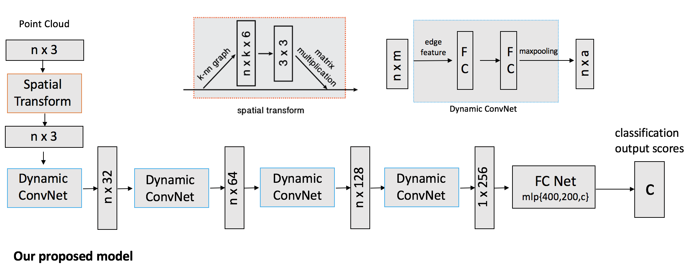

# Dynamic-Filter-CNN for Object Classification in Point Clouds

## Authors

This repository is the work of Guanghua Pan from Shanghai Jiaotong University and Prince Wang from the University of California-Berkeley. It is a research project under the Brain-Inspired Application Technology Center(BATC) at Shanghai Jiaotong University.


Further information about BATC, please visit: http://bat.sjtu.edu.cn/


Further information about the model please contact [Prince Wang](https://www.linkedin.com/in/prince-wang-19511717a/) and [Guanghua](https://github.com/SteveJokes/)

## Overview

We propose a new neural network architecture for classification of objects in 3D point cloud data. We applied convolution layers which dynamically generates convolution kernel based on the edge features it learned from the point clouds. For its dynamic generation of conv. kernels, the model is named Dynamic Filter CNN.


## Model Architecture




## Implementation

The model is implemented in TensorFlow. 

## Installation

Install <a href="https://www.tensorflow.org/get_started/os_setup" target="_blank">TensorFlow</a>. You may also need to install h5py.

To install h5py for Python:
```bash
sudo apt-get install libhdf5-dev
sudo pip install h5py
```

## Usage
To train a model to classify point clouds sampled from 3D shapes:

    python train.py

Log files and network parameters will be saved to `log` folder in default. Point clouds of <a href="http://modelnet.cs.princeton.edu/" target="_blank">ModelNet40</a> models in HDF5 files are already included in this repository. Each point cloud contains 1024 points uniformly sampled from a shape surface. Each cloud is zero-mean and normalized into an unit sphere. 

To see HELP for the training script:

    python train.py -h

To use TensorBoard to view the network architecture and visualize the training progress.

    tensorboard --logdir log

After the above training, to evaluate the model:

    python evaluate.py

## Acknowledgement

Our work borrows from many other papers in the field of 3D Point Cloud Deep Learning. The works we referred to are as follows:


* Li, Yangyan, et al. "PointCNN: Convolution on X-transformed points." Advances in Neural 	Information Processing Systems. 2018.

* Qi, Charles R., et al. "Pointnet: Deep learning on point sets for 3d classification and 	segmentation." Proceedings of the IEEE Conference on Computer Vision and Pattern 	Recognition. 2017.

* Qi, Charles Ruizhongtai, et al. "Pointnet++: Deep hierarchical feature learning on point sets 	in a metric space." Advances in Neural Information Processing Systems. 2017.

* Wang, Yue, et al. "Dynamic graph cnn for learning on point clouds." arXiv preprint 	arXiv:1801.07829 (2018).

* Simonovsky, Martin, and Nikos Komodakis. "Dynamic edge-conditioned filters in 	convolutional neural networks on graphs." Proceedings of the IEEE conference on 	computer vision and pattern recognition. 2017.

